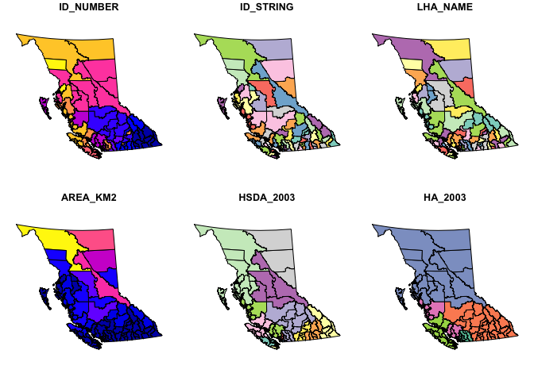

Module 7 (SQL & GIS) in R
================
Andrew Fullerton
2024-11-07

# 1) Setup

``` r
library(sqldf)
```

    ## Loading required package: gsubfn

    ## Loading required package: proto

    ## Warning in doTryCatch(return(expr), name, parentenv, handler): unable to load shared object '/Library/Frameworks/R.framework/Resources/modules//R_X11.so':
    ##   dlopen(/Library/Frameworks/R.framework/Resources/modules//R_X11.so, 0x0006): Library not loaded: /opt/X11/lib/libSM.6.dylib
    ##   Referenced from: <BDCE065B-0E14-3F82-A5E6-7C0A970A6C32> /Library/Frameworks/R.framework/Versions/4.4-x86_64/Resources/modules/R_X11.so
    ##   Reason: tried: '/opt/X11/lib/libSM.6.dylib' (no such file), '/System/Volumes/Preboot/Cryptexes/OS/opt/X11/lib/libSM.6.dylib' (no such file), '/opt/X11/lib/libSM.6.dylib' (no such file), '/Library/Frameworks/R.framework/Resources/lib/libSM.6.dylib' (no such file), '/Library/Java/JavaVirtualMachines/jdk-11.0.18+10/Contents/Home/lib/server/libSM.6.dylib' (no such file)

    ## tcltk DLL is linked to '/opt/X11/lib/libX11.6.dylib'

    ## Could not load tcltk.  Will use slower R code instead.

    ## Loading required package: RSQLite

``` r
# Import mortality data
mortality <- readRDS("data/m3_mortality.rds")

# Import m4dat data
m4dat <- readRDS("data/m4dat.rds")
```

# 2) Examining the PCCF

``` r
# Read in pccf data
pccf <- read.csv("data/postal_code_conversion_file.csv")
pccf$start_date <- as.Date(pccf$start_date) # Format start date
pccf$end_date <- as.Date(pccf$end_date) # Format end date

str(pccf) # See what the data looks like
```

    ## 'data.frame':    563515 obs. of  66 variables:
    ##  $ postal_code_georeference_key     : int  1 2 3 4 5 6 7 8 9 10 ...
    ##  $ postal_code                      : chr  "V0A1A0" "V0A1B0" "V0A1C0" "V0A1E0" ...
    ##  $ effective_date                   : chr  "1979-01-01" "1979-01-01" "1979-01-01" "1979-01-01" ...
    ##  $ retired_date                     : chr  NA NA "1987-06-01" NA ...
    ##  $ latitude                         : num  50.5 50.8 NA 50.7 51.4 ...
    ##  $ longitude                        : num  -116 -116 NA -116 -116 ...
    ##  $ community_name                   : chr  "ATHALMER" "BRISCO" "DONALD STATION" "EDGEWATER" ...
    ##  $ census_div_code                  : int  NA NA NA NA NA NA NA NA NA NA ...
    ##  $ census_subdiv_code               : int  NA NA NA NA NA NA NA NA NA NA ...
    ##  $ full_census_subdiv_code          : int  1806 1048 39013 1048 39011 39007 39007 39007 39007 39011 ...
    ##  $ census_subdiv_name               : chr  "SHUSWAP" "EAST KOOTENAY G" NA "EAST KOOTENAY G" ...
    ##  $ census_metro_agglom_area_code    : int  998 998 0 998 998 998 998 998 998 998 ...
    ##  $ census_metro_agglom_area_name    : chr  "Weakly Influenced Zone" "Weakly Influenced Zone" NA "Weakly Influenced Zone" ...
    ##  $ census_tract                     : num  NA NA NA NA NA NA NA NA NA NA ...
    ##  $ dissemination_area_code          : int  NA NA NA NA NA NA NA NA NA NA ...
    ##  $ designated_place_code            : int  9959 93 0 93 9959 9959 9959 9959 9959 9959 ...
    ##  $ dev_econ_region_code             : int  4 4 3 4 3 3 3 3 3 3 ...
    ##  $ dev_econ_region_name             : chr  "Kootenay" "Kootenay" "Thompson - Okanagan" "Kootenay" ...
    ##  $ health_authority_code            : int  1 1 1 1 1 1 1 1 1 1 ...
    ##  $ health_authority_name            : chr  "Interior" "Interior" "Interior" "Interior" ...
    ##  $ health_service_delivery_area_code: int  11 11 11 11 11 11 11 11 11 11 ...
    ##  $ health_service_delivery_area_name: chr  "East Kootenay" "East Kootenay" "East Kootenay" "East Kootenay" ...
    ##  $ local_health_area_code           : int  4 4 18 4 18 18 18 18 18 18 ...
    ##  $ local_health_area_name           : chr  "Windermere" "Windermere" "Golden" "Windermere" ...
    ##  $ micro_health_area_code           : int  0 0 0 0 0 0 0 0 0 0 ...
    ##  $ micro_health_area_name           : chr  NA NA NA NA ...
    ##  $ mcfd_region_code                 : int  1 1 NA 1 1 1 1 1 1 1 ...
    ##  $ mcfd_region_name                 : chr  "Interior" "Interior" NA "Interior" ...
    ##  $ mcfd_service_delivery_area_code  : int  NA NA NA NA NA NA NA NA NA NA ...
    ##  $ mcfd_service_delivery_area_name  : chr  NA NA NA NA ...
    ##  $ mcfd_local_service_area_code     : int  NA NA NA NA NA NA NA NA NA NA ...
    ##  $ mcfd_local_service_area_name     : chr  NA NA NA NA ...
    ##  $ prov_elect_district_1999_code    : int  13 13 10 13 13 13 13 13 13 13 ...
    ##  $ prov_elect_district_1999_name    : chr  "Columbia River-Revelstoke" "Columbia River-Revelstoke" "Cariboo South" "Columbia River-Revelstoke" ...
    ##  $ prov_elect_district_2009_code    : int  14 14 0 14 14 14 14 14 14 14 ...
    ##  $ prov_elect_district_2009_name    : chr  "Columbia River-Revelstoke" "Columbia River-Revelstoke" NA "Columbia River-Revelstoke" ...
    ##  $ school_district_code             : int  6 6 18 6 6 6 6 6 6 6 ...
    ##  $ school_district_name             : chr  "Rocky Mountain" "Rocky Mountain" NA "Rocky Mountain" ...
    ##  $ college_region_code              : int  5 5 0 5 5 5 5 5 5 5 ...
    ##  $ college_region_name              : chr  "Rockies" "Rockies" NA "Rockies" ...
    ##  $ federal_electoral_district_code  : int  59012 59012 0 59012 59012 59012 59012 59012 59012 59012 ...
    ##  $ federal_electoral_district_name  : chr  "Kootenay - Columbia" "Kootenay - Columbia" NA "Kootenay - Columbia" ...
    ##  $ respondent_code                  : int  59799 59799 0 59799 59762 59762 59762 59762 59762 59762 ...
    ##  $ respondent_location              : chr  "COLUMBIA VALLEY" "COLUMBIA VALLEY" NA "COLUMBIA VALLEY" ...
    ##  $ respondent_force_type            : chr  "RCMP (RURAL)" "RCMP (RURAL)" NA "RCMP (RURAL)" ...
    ##  $ add_type                         : int  4 2 NA 5 2 5 2 2 2 2 ...
    ##  $ up_date                          : int  NA NA 71997 NA NA NA NA NA NA NA ...
    ##  $ geoflag                          : chr  NA NA NA NA ...
    ##  $ add1                             : chr  "ATHALMER" "HYW 95 NORTH" NA "EDGEWATER" ...
    ##  $ add2                             : chr  "PO" NA NA "PO" ...
    ##  $ add3                             : chr  NA NA NA NA ...
    ##  $ add4                             : chr  NA NA NA NA ...
    ##  $ add5                             : chr  "R" "002854" NA NA ...
    ##  $ add6                             : chr  "0001" "002854" NA NA ...
    ##  $ st_seq                           : int  3 2 NA 3 2 1 1 3 3 3 ...
    ##  $ suite_to                         : chr  NA NA NA NA ...
    ##  $ suite_from                       : chr  NA NA NA NA ...
    ##  $ status                           : chr  "ACT" "ACT" "ACT" "ACT" ...
    ##  $ source                           : chr  "TMF" "TMF" "TMF" "TMF" ...
    ##  $ is_retired                       : chr  "N" "N" "Y" "N" ...
    ##  $ start_date                       : Date, format: "1979-01-01" "1979-01-01" ...
    ##  $ end_date                         : Date, format: "2012-01-31" "2012-01-31" ...
    ##  $ inserted_dt_tm                   : chr  "2014-11-20 11:17:16" "2014-11-20 11:17:16" "2014-11-20 11:17:16" "2014-11-20 11:17:16" ...
    ##  $ updated_dt_tm                    : chr  "2014-11-20 11:21:36" "2014-11-20 11:21:36" "2014-11-20 11:21:36" "2014-11-20 11:21:36" ...
    ##  $ is_current                       : chr  "N" "N" "N" "N" ...
    ##  $ hash_value                       : chr  "as.raw(c(0xb3" "as.raw(c(0xe4" "as.raw(c(0x14" "as.raw(c(0x56" ...

``` r
# Order by postal code (ascending) and by end_date (descending)
pccf <- pccf[order(pccf$postal_code, -as.numeric(pccf$end_date)), ]

# View first 10 rows, only these three variables
head(pccf[, c("postal_code", "start_date", "end_date")], n = 10)
```

    ##        postal_code start_date   end_date
    ## 385056      V0A0A0 2014-10-01 2100-12-31
    ## 526933      V0A0A1 2015-10-01 2100-12-31
    ## 268441      V0A0A1 2014-01-01 2015-09-30
    ## 267885      V0A0A1 2013-10-01 2013-12-31
    ## 267886      V0A0A2 2013-10-01 2100-12-31
    ## 268442      V0A0A3 2014-01-01 2100-12-31
    ## 267887      V0A0A3 2013-10-01 2013-12-31
    ## 267888      V0A0A4 2013-10-01 2100-12-31
    ## 268443      V0A0A5 2014-01-01 2100-12-31
    ## 267889      V0A0A5 2013-10-01 2013-12-31

### Reduce the dataset to the essential variables

``` r
pccf_short <- sqldf(
  "SELECT postal_code, 
          start_date, 
          end_date,
          longitude,
          latitude
   FROM pccf"
)

str(pccf_short) # View changes
```

    ## 'data.frame':    563515 obs. of  5 variables:
    ##  $ postal_code: chr  "V0A0A0" "V0A0A1" "V0A0A1" "V0A0A1" ...
    ##  $ start_date : Date, format: "2014-10-01" "2015-10-01" ...
    ##  $ end_date   : Date, format: "2100-12-31" "2100-12-31" ...
    ##  $ longitude  : num  -117 -116 -116 -116 -116 ...
    ##  $ latitude   : num  51.3 50.5 50.5 50.5 50.7 ...

### Explore how many distinct postal code entries are in the pccf

``` r
sqldf(
  "SELECT count(postal_code) AS tot_postal_code,
          count(distinct(postal_code)) AS unique_postal_code
   FROM pccf_short"
)
```

    ##   tot_postal_code unique_postal_code
    ## 1          563515             129728

### Explore the number of times a given postal code appears

``` r
sqldf(
  "SELECT postal_code,
          count(postal_code) AS pc_count
   FROM pccf_short
   GROUP BY postal_code
   LIMIT 10"
)
```

    ##    postal_code pc_count
    ## 1       V0A0A0        1
    ## 2       V0A0A1        3
    ## 3       V0A0A2        1
    ## 4       V0A0A3        2
    ## 5       V0A0A4        1
    ## 6       V0A0A5        2
    ## 7       V0A1A0        4
    ## 8       V0A1B0        3
    ## 9       V0A1C0        4
    ## 10      V0A1E0        4

### Get the average, min, and max number of times each postal code appears

``` r
sqldf(
  "SELECT AVG(pc_count) AS mean_pc_count,
          MIN(pc_count) AS min_pc_count,
          MAX(pc_count) AS max_pc_count
   FROM (SELECT COUNT(postal_code) AS pc_count
         FROM pccf_short
         GROUP BY postal_code)"
)
```

    ##   mean_pc_count min_pc_count max_pc_count
    ## 1      4.343819            1           11

# 3) Geocoding the Mortality Dataset

``` r
str(mortality) # Remind ourselves what this dataset looks like
```

    ## 'data.frame':    231178 obs. of  10 variables:
    ##  $ uid       : int  122745837 122745924 122745926 122745928 122745933 122745940 122745945 122745948 122745955 122745957 ...
    ##  $ death_date: Date, format: "2005-02-28" "2008-12-10" ...
    ##  $ age       : chr  "60 years" "50 years" "94 years" "87 years" ...
    ##  $ age_cat   : Factor w/ 21 levels "","<1 year","1-4 years",..: 15 13 20 20 17 20 15 20 18 19 ...
    ##  $ ucod      : chr  "C80" "W86" "C260" "INC" ...
    ##  $ sex       : Factor w/ 4 levels "","Female","Male",..: 2 2 3 3 2 2 3 2 3 3 ...
    ##  $ lhacode   : int  162 34 34 34 41 75 42 163 75 75 ...
    ##  $ lhadesc   : chr  "Vancouver - Downtown Eastside (162)" "Abbotsford (034)" "Abbotsford (034)" "Abbotsford (034)" ...
    ##  $ location  : chr  "" "HOSPITAL" "" "RESIDENTIAL INSTITUTION" ...
    ##  $ postcode  : chr  "V6A1G3" "V2T3N9" "V2T5M2" "V2T6V3" ...

### Count null postal codes (attempt 1)

``` r
sqldf(
  "SELECT COUNT(uid)
   FROM mortality
   WHERE postcode IS NULL"
)
```

    ##   COUNT(uid)
    ## 1          0

Hmm … this is exactly how we did it in *SAS*. Why the difference in
output?

``` r
sum(is.na(mortality$postcode)) # Count number of null values using base R
```

    ## [1] 0

``` r
nrow(mortality[mortality$postcode == '.', ]) # Count number of cells with '.'
```

    ## [1] 0

``` r
nrow(mortality[mortality$postcode == '', ]) # Count number of empty cells
```

    ## [1] 262

### Count null postal codes (attempt 2)

``` r
sqldf(
  "SELECT COUNT(uid)
   FROM mortality
   WHERE postcode = ''"
)
```

    ##   COUNT(uid)
    ## 1        262

That looks better! Different software packages handle missing values
differently. Since postcode is stored as a character variable in R, it
will not convert missing cells to `NA`s by default.

### Create a version of the mortality data with no missing values

``` r
m7_mortality <- sqldf(
  "SELECT *
   FROM mortality
   WHERE postcode != ''"
)

str(m7_mortality) # 230916 observations in the new mortality dataset
```

    ## 'data.frame':    230916 obs. of  10 variables:
    ##  $ uid       : int  122745837 122745924 122745926 122745928 122745933 122745940 122745945 122745948 122745955 122745957 ...
    ##  $ death_date: Date, format: "2005-02-28" "2008-12-10" ...
    ##  $ age       : chr  "60 years" "50 years" "94 years" "87 years" ...
    ##  $ age_cat   : Factor w/ 21 levels "","<1 year","1-4 years",..: 15 13 20 20 17 20 15 20 18 19 ...
    ##  $ ucod      : chr  "C80" "W86" "C260" "INC" ...
    ##  $ sex       : Factor w/ 4 levels "","Female","Male",..: 2 2 3 3 2 2 3 2 3 3 ...
    ##  $ lhacode   : int  162 34 34 34 41 75 42 163 75 75 ...
    ##  $ lhadesc   : chr  "Vancouver - Downtown Eastside (162)" "Abbotsford (034)" "Abbotsford (034)" "Abbotsford (034)" ...
    ##  $ location  : chr  "" "HOSPITAL" "" "RESIDENTIAL INSTITUTION" ...
    ##  $ postcode  : chr  "V6A1G3" "V2T3N9" "V2T5M2" "V2T6V3" ...

### Test the linkage plan

``` r
str(pccf_short) # Remind ourselves what our pccf data looks like
```

    ## 'data.frame':    563515 obs. of  5 variables:
    ##  $ postal_code: chr  "V0A0A0" "V0A0A1" "V0A0A1" "V0A0A1" ...
    ##  $ start_date : Date, format: "2014-10-01" "2015-10-01" ...
    ##  $ end_date   : Date, format: "2100-12-31" "2100-12-31" ...
    ##  $ longitude  : num  -117 -116 -116 -116 -116 ...
    ##  $ latitude   : num  51.3 50.5 50.5 50.5 50.7 ...

``` r
sqldf(
  "SELECT uid,
          postcode AS pc_mort,
          postal_code AS pc_pccf,
          start_date,
          death_date,
          end_date,
          longitude,
          latitude
   FROM m7_mortality AS a JOIN pccf_short AS b ON a.postcode=b.postal_code
   WHERE a.death_date BETWEEN b.start_date AND b.end_date"
) |>
  head(n = 10)
```

    ##          uid pc_mort pc_pccf start_date death_date   end_date longitude
    ## 1  122745837  V6A1G3  V6A1G3 1979-01-01 2005-02-28 2012-01-31 -123.0994
    ## 2  122745924  V2T3N9  V2T3N9 1979-01-01 2008-12-10 2012-01-31 -122.3154
    ## 3  122745926  V2T5M2  V2T5M2 1992-05-01 2007-03-17 2012-01-31 -122.3600
    ## 4  122745928  V2T6V3  V2T6V3 2012-02-01 2012-07-29 2014-06-30 -122.3586
    ## 5  122745933  V5J3V3  V5J3V3 1979-01-01 1999-11-04 2012-01-31 -123.0050
    ## 6  122745940  V2V4R3  V2V4R3 2012-02-01 2014-01-17 2014-06-30 -122.2998
    ## 7  122745945  V2X0C9  V2X0C9 1988-04-01 2011-05-31 2012-01-31 -122.6610
    ## 8  122745948  V5K2M4  V5K2M4 1979-01-01 2006-11-25 2012-01-31 -123.0562
    ## 9  122745955  V2V4A6  V2V4A6 1979-01-01 2007-01-22 2012-01-31 -122.2999
    ## 10 122745957  V2V1K5  V2V1K5 1979-01-01 2003-05-23 2012-01-31 -122.2984
    ##    latitude
    ## 1  49.28319
    ## 2  49.04766
    ## 3  49.05793
    ## 4  49.06620
    ## 5  49.22011
    ## 6  49.14152
    ## 7  49.21519
    ## 8  49.27747
    ## 9  49.13661
    ## 10 49.13528

### Linking the data

``` r
mortality_comp <- sqldf(
  "SELECT uid,
          postcode AS pc_mort,
          postal_code AS pc_pccf,
          start_date,
          death_date,
          end_date,
          longitude,
          latitude
   FROM m7_mortality AS a JOIN pccf_short AS b ON a.postcode=b.postal_code
   WHERE a.death_date BETWEEN b.start_date AND b.end_date"
)

str(mortality_comp) # Note that the number of observations has changed
```

    ## 'data.frame':    230901 obs. of  8 variables:
    ##  $ uid       : int  122745837 122745924 122745926 122745928 122745933 122745940 122745945 122745948 122745955 122745957 ...
    ##  $ pc_mort   : chr  "V6A1G3" "V2T3N9" "V2T5M2" "V2T6V3" ...
    ##  $ pc_pccf   : chr  "V6A1G3" "V2T3N9" "V2T5M2" "V2T6V3" ...
    ##  $ start_date: Date, format: "1979-01-01" "1979-01-01" ...
    ##  $ death_date: Date, format: "2005-02-28" "2008-12-10" ...
    ##  $ end_date  : Date, format: "2012-01-31" "2012-01-31" ...
    ##  $ longitude : num  -123 -122 -122 -122 -123 ...
    ##  $ latitude  : num  49.3 49 49.1 49.1 49.2 ...

Look at the dropped observations. Since we know that any rows in
`m7_mortality` without a corresponding entry (i.e. were dropped) will
have a null id in `mortality_comp`, we can produce a list of the dropped
observations.

``` r
sqldf(
  "SELECT a.uid AS orig_id,
          b.uid AS unlinked_id,
          a.postcode
   FROM m7_mortality AS a LEFT JOIN mortality_comp as b ON a.uid=b.uid
   WHERE b.uid is NULL"
) 
```

    ##       orig_id unlinked_id postcode
    ## 1   123762284          NA   V7A6M2
    ## 2   123763323          NA   V7W4M1
    ## 3   123785946          NA   V3T6J2
    ## 4   123796199          NA   V4N3K7
    ## 5   123803039          NA   V3E3Z3
    ## 6   123823021          NA   V2R9S7
    ## 7   123829779          NA   V5B5K5
    ## 8   220240542          NA   V4W4H4
    ## 9   308474771          NA   V3W0F1
    ## 10  330786085          NA   V4R6H5
    ## 11  404890893          NA   V3P0Y6
    ## 12  726802965          NA   V6Y4K4
    ## 13 1001598388          NA   V4M5M3
    ## 14 1046736881          NA   V3S0K8
    ## 15 1181740339          NA   V4N0N4

We lost 15 observations.

``` r
# Let's investigate further...
sqldf(
  "SELECT a.uid,
          postcode,
          death_date,
          postal_code,
          start_date,
          end_date
   FROM (SELECT a.uid,
                b.uid AS unlinked_id,
                a.postcode,
                a.death_date
         FROM m7_mortality AS a LEFT JOIN mortality_comp AS b ON a.uid=b.uid
         WHERE b.uid is NULL) AS a
   LEFT JOIN pccf_short AS b ON a.postcode=b.postal_code"
)
```

    ##           uid postcode death_date postal_code start_date   end_date
    ## 1   123762284   V7A6M2 2005-07-04        <NA>       <NA>       <NA>
    ## 2   123763323   V7W4M1 2001-02-25        <NA>       <NA>       <NA>
    ## 3   123785946   V3T6J2 2004-02-25        <NA>       <NA>       <NA>
    ## 4   123796199   V4N3K7 2007-03-30        <NA>       <NA>       <NA>
    ## 5   123803039   V3E3Z3 2006-11-03        <NA>       <NA>       <NA>
    ## 6   123823021   V2R9S7 2003-03-28        <NA>       <NA>       <NA>
    ## 7   123829779   V5B5K5 2014-06-28        <NA>       <NA>       <NA>
    ## 8   220240542   V4W4H4 2013-09-29        <NA>       <NA>       <NA>
    ## 9   308474771   V3W0F1 2002-08-23        <NA>       <NA>       <NA>
    ## 10  330786085   V4R6H5 2001-11-23        <NA>       <NA>       <NA>
    ## 11  404890893   V3P0Y6 2003-08-27        <NA>       <NA>       <NA>
    ## 12  726802965   V6Y4K4 1998-12-21      V6Y4K4 2003-10-01 2012-01-31
    ## 13  726802965   V6Y4K4 1998-12-21      V6Y4K4 2012-02-01 2014-06-30
    ## 14  726802965   V6Y4K4 1998-12-21      V6Y4K4 2014-07-01 2014-09-30
    ## 15  726802965   V6Y4K4 1998-12-21      V6Y4K4 2014-10-01 2015-02-28
    ## 16  726802965   V6Y4K4 1998-12-21      V6Y4K4 2015-03-01 2100-12-31
    ## 17 1001598388   V4M5M3 2004-01-03        <NA>       <NA>       <NA>
    ## 18 1046736881   V3S0K8 1998-11-20      V3S0K8 2001-02-01 2012-01-31
    ## 19 1046736881   V3S0K8 1998-11-20      V3S0K8 2012-02-01 2014-06-30
    ## 20 1046736881   V3S0K8 1998-11-20      V3S0K8 2014-07-01 2014-09-30
    ## 21 1046736881   V3S0K8 1998-11-20      V3S0K8 2014-10-01 2014-12-31
    ## 22 1046736881   V3S0K8 1998-11-20      V3S0K8 2015-01-01 2100-12-31
    ## 23 1181740339   V4N0N4 1999-05-22      V4N0N4 1999-06-24 2012-01-31
    ## 24 1181740339   V4N0N4 1999-05-22      V4N0N4 2012-02-01 2014-06-30
    ## 25 1181740339   V4N0N4 1999-05-22      V4N0N4 2014-07-01 2014-09-30
    ## 26 1181740339   V4N0N4 1999-05-22      V4N0N4 2014-10-01 2100-12-31

From this, we can see that the mortality data were dropped during
linkage because the death dates were not found between the start and end
dates while some were missing the necessary data

### Create the final geocoded dataset

``` r
mortality_geocoded <- sqldf(
  "SELECT uid,
          death_date,
          longitude,
          latitude
   FROM mortality_comp
   WHERE longitude is NOT NULL AND latitude is NOT NULL"
)

str(mortality_geocoded) # Verify that the dataset has 229557 rows as intended
```

    ## 'data.frame':    229557 obs. of  4 variables:
    ##  $ uid       : int  122745837 122745924 122745926 122745928 122745933 122745940 122745945 122745948 122745955 122745957 ...
    ##  $ death_date: Date, format: "2005-02-28" "2008-12-10" ...
    ##  $ longitude : num  -123 -122 -122 -122 -123 ...
    ##  $ latitude  : num  49.3 49 49.1 49.1 49.2 ...

### Save the final dataset to the m7 folder

``` r
getwd() # check what local directory you're in
```

    ## [1] "/Users/andrewfullerton/Desktop/Code/spph553-in-r"

``` r
setwd("/Users/andrewfullerton/Desktop/Code/spph553-in-r") # replace with local file path

if (!dir.exists("m7")) { # if no folder named m7 exists, create one
  dir.create("m7")
} 

saveRDS(mortality_geocoded, "m7/mortality_geocoded.rds") # save in m7 as RDS
```

# 4) Mapping

### Select only the variables we want to use going forward

``` r
mapping_mortality <- sqldf(
  "SELECT uid,
          death_date,
          lhacode
   FROM mortality 
   WHERE lhacode IS NOT NULL"
)
```

``` r
temp <- sqldf(
  "SELECT date,
          temperature_Min,
          temperature_Max
   FROM m4dat"
)
```

### Testing our linkage

``` r
sqldf(
  "SELECT a.*,
          b.temperature_Min,
          b.temperature_Max
   FROM mapping_mortality AS a LEFT JOIN temp AS b ON a.death_date=b.date"
) |>
  head(n = 10)
```

    ##          uid death_date lhacode temperature_Min temperature_Max
    ## 1  122745837 2005-02-28     162             2.7            11.6
    ## 2  122745924 2008-12-10      34             5.0             7.7
    ## 3  122745926 2007-03-17      34             7.8             9.6
    ## 4  122745928 2012-07-29      34            13.3            23.5
    ## 5  122745933 1999-11-04      41             2.2             7.9
    ## 6  122745940 2014-01-17      75             3.7             5.3
    ## 7  122745945 2011-05-31      42             8.4            17.2
    ## 8  122745948 2006-11-25     163             0.2             3.3
    ## 9  122745955 2007-01-22      75             4.0             7.1
    ## 10 122745957 2003-05-23      75            13.0            18.6

### Linking the data

``` r
mortality_lha <- sqldf(
  "SELECT a.*,
          b.temperature_Min,
          b.temperature_Max
   FROM mapping_mortality AS a LEFT JOIN temp AS b ON a.death_date=b.date"
)

str(mortality_lha) # Verify that the dataset has 231178 rows as intended
```

    ## 'data.frame':    231178 obs. of  5 variables:
    ##  $ uid            : int  122745837 122745924 122745926 122745928 122745933 122745940 122745945 122745948 122745955 122745957 ...
    ##  $ death_date     : Date, format: "2005-02-28" "2008-12-10" ...
    ##  $ lhacode        : int  162 34 34 34 41 75 42 163 75 75 ...
    ##  $ temperature_Min: num  2.7 5 7.8 13.3 2.2 3.7 8.4 0.2 4 13 ...
    ##  $ temperature_Max: num  11.6 7.7 9.6 23.5 7.9 5.3 17.2 3.3 7.1 18.6 ...

``` r
sqldf(
  "SELECT COUNT(*)
   FROM mortality_lha
   WHERE lhacode IS NOT NULL"
) # To be extra sure, run this SQL query
```

    ##   COUNT(*)
    ## 1   231178

### Create hot days and cold days datasets

### Store the 99.9th hottest temperature and the 0.1th coldest temperature

``` r
quantile(mortality_lha$temperature_Max, probs = 0.999) # hottest temps
```

    ## 99.9% 
    ##  29.5

``` r
quantile(mortality_lha$temperature_Min, probs = 0.001) # coldest temps
```

    ## 0.1% 
    ## -9.7

### Create hot days dataset

``` r
mortality_hot_days <- sqldf(
  "SELECT lhacode AS id_number,
          COUNT(uid) AS death_counts
   FROM mortality_lha
   WHERE temperature_Max > 29.5
   GROUP BY lhacode"
)
```

### Create cold days datase

``` r
mortality_cold_days <- sqldf(
  "SELECT lhacode AS id_number,
          COUNT(uid) AS death_counts
   FROM mortality_lha
   WHERE temperature_Min < (-9.5)
   GROUP BY lhacode"
)
```

# 4) Choropleth maps

Unfortunately, base R doesn’t support reading/writing shape files ‘out
of the box’. Technically, we could write a function to do this, but this
would require dealing with regular expressions (and matrices) and is way
beyond our scope.

So, below are two methods of mapping the data: The first uses base R
only and a bit of data processing magic. It falls short of a choropleth
map but is a visual representation of the data. The second uses a
lightweight package for handling GIS data called `sf`.

``` r
gva <- c(161:166, 201, 202, 37, 38, 42, 44, 45, 43, 42, 75, 34, 35) # gva codes

mortality_hot_days_gva <- mortality_hot_days[mortality_hot_days$id_number %in% gva, ]
str(mortality_hot_days_gva) # View the new dataset
```

    ## 'data.frame':    17 obs. of  2 variables:
    ##  $ id_number   : int  34 35 37 38 42 43 44 45 75 161 ...
    ##  $ death_counts: int  14 11 12 11 4 15 19 8 4 12 ...

``` r
mortality_cold_days_gva <- mortality_cold_days[mortality_cold_days$id_number %in% gva, ]
str(mortality_cold_days_gva) # View the new dataset
```

    ## 'data.frame':    17 obs. of  2 variables:
    ##  $ id_number   : int  34 35 37 38 42 43 44 45 75 161 ...
    ##  $ death_counts: int  18 17 10 20 12 14 18 9 7 15 ...

## Base R method

``` r
bcmap_baseR <- readRDS("data/bcmap_data.rds") # Note that this is only possible with some data pre-processing

str(bcmap_baseR) # View the data we've just loaded into R
```

    ## 'data.frame':    83 obs. of  7 variables:
    ##  $ ID_NUMBER: int  1 2 3 4 5 6 7 9 10 11 ...
    ##  $ ID_STRING: chr  "1" "2" "3" "4" ...
    ##  $ LHA_NAME : chr  "Fernie" "Cranbrook" "Kimberley" "Windermere" ...
    ##  $ AREA_KM2 : num  8059 4429 4361 10974 3788 ...
    ##  $ HSDA_2003: chr  "East Kootenay" "East Kootenay" "East Kootenay" "East Kootenay" ...
    ##  $ HA_2003  : chr  "Interior" "Interior" "Interior" "Interior" ...
    ##  $ geometry :List of 83
    ##   ..$ :List of 1
    ##   .. ..$ :List of 1
    ##   .. .. ..$ : num [1:258, 1:2] 1870324 1869664 1869832 1765062 1764937 ...
    ##   .. ..- attr(*, "class")= chr [1:3] "XY" "MULTIPOLYGON" "sfg"
    ##   ..$ :List of 1
    ##   .. ..$ :List of 1
    ##   .. .. ..$ : num [1:182, 1:2] 1765062 1728219 1725658 1720095 1722159 ...
    ##   .. ..- attr(*, "class")= chr [1:3] "XY" "MULTIPOLYGON" "sfg"
    ##   ..$ :List of 1
    ##   .. ..$ :List of 1
    ##   .. .. ..$ : num [1:163, 1:2] 1762362 1762264 1764285 1764891 1763998 ...
    ##   .. ..- attr(*, "class")= chr [1:3] "XY" "MULTIPOLYGON" "sfg"
    ##   ..$ :List of 1
    ##   .. ..$ :List of 1
    ##   .. .. ..$ : num [1:302, 1:2] 1761996 1764681 1765820 1767908 1769298 ...
    ##   .. ..- attr(*, "class")= chr [1:3] "XY" "MULTIPOLYGON" "sfg"
    ##   ..$ :List of 1
    ##   .. ..$ :List of 1
    ##   .. .. ..$ : num [1:84, 1:2] 1709087 1711944 1714076 1712076 1712018 ...
    ##   .. ..- attr(*, "class")= chr [1:3] "XY" "MULTIPOLYGON" "sfg"
    ##   ..$ :List of 1
    ##   .. ..$ :List of 1
    ##   .. .. ..$ : num [1:286, 1:2] 1647822 1647926 1648833 1649207 1650262 ...
    ##   .. ..- attr(*, "class")= chr [1:3] "XY" "MULTIPOLYGON" "sfg"
    ##   ..$ :List of 1
    ##   .. ..$ :List of 1
    ##   .. .. ..$ : num [1:175, 1:2] 1629452 1629641 1631604 1633056 1632964 ...
    ##   .. ..- attr(*, "class")= chr [1:3] "XY" "MULTIPOLYGON" "sfg"
    ##   ..$ :List of 1
    ##   .. ..$ :List of 1
    ##   .. .. ..$ : num [1:116, 1:2] 1576139 1577230 1577753 1577315 1576620 ...
    ##   .. ..- attr(*, "class")= chr [1:3] "XY" "MULTIPOLYGON" "sfg"
    ##   ..$ :List of 1
    ##   .. ..$ :List of 1
    ##   .. .. ..$ : num [1:249, 1:2] 1635254 1634703 1632415 1632205 1632618 ...
    ##   .. ..- attr(*, "class")= chr [1:3] "XY" "MULTIPOLYGON" "sfg"
    ##   ..$ :List of 1
    ##   .. ..$ :List of 1
    ##   .. .. ..$ : num [1:38, 1:2] 1606490 1619236 1620648 1620759 1619236 ...
    ##   .. ..- attr(*, "class")= chr [1:3] "XY" "MULTIPOLYGON" "sfg"
    ##   ..$ :List of 1
    ##   .. ..$ :List of 1
    ##   .. .. ..$ : num [1:129, 1:2] 1571944 1572702 1574668 1574802 1575755 ...
    ##   .. ..- attr(*, "class")= chr [1:3] "XY" "MULTIPOLYGON" "sfg"
    ##   ..$ :List of 1
    ##   .. ..$ :List of 1
    ##   .. .. ..$ : num [1:137, 1:2] 1541591 1490375 1490373 1490359 1489729 ...
    ##   .. ..- attr(*, "class")= chr [1:3] "XY" "MULTIPOLYGON" "sfg"
    ##   ..$ :List of 1
    ##   .. ..$ :List of 1
    ##   .. .. ..$ : num [1:56, 1:2] 1490359 1490373 1466667 1465821 1465124 ...
    ##   .. ..- attr(*, "class")= chr [1:3] "XY" "MULTIPOLYGON" "sfg"
    ##   ..$ :List of 1
    ##   .. ..$ :List of 1
    ##   .. .. ..$ : num [1:64, 1:2] 1485427 1468575 1468901 1466482 1466564 ...
    ##   .. ..- attr(*, "class")= chr [1:3] "XY" "MULTIPOLYGON" "sfg"
    ##   ..$ :List of 1
    ##   .. ..$ :List of 1
    ##   .. .. ..$ : num [1:82, 1:2] 1426336 1429196 1430483 1431237 1430390 ...
    ##   .. ..- attr(*, "class")= chr [1:3] "XY" "MULTIPOLYGON" "sfg"
    ##   ..$ :List of 1
    ##   .. ..$ :List of 1
    ##   .. .. ..$ : num [1:169, 1:2] 1426907 1428645 1430020 1432530 1433427 ...
    ##   .. ..- attr(*, "class")= chr [1:3] "XY" "MULTIPOLYGON" "sfg"
    ##   ..$ :List of 1
    ##   .. ..$ :List of 1
    ##   .. .. ..$ : num [1:336, 1:2] 1673989 1672801 1672675 1674830 1675064 ...
    ##   .. ..- attr(*, "class")= chr [1:3] "XY" "MULTIPOLYGON" "sfg"
    ##   ..$ :List of 1
    ##   .. ..$ :List of 1
    ##   .. .. ..$ : num [1:247, 1:2] 1605229 1605150 1602979 1602209 1601824 ...
    ##   .. ..- attr(*, "class")= chr [1:3] "XY" "MULTIPOLYGON" "sfg"
    ##   ..$ :List of 1
    ##   .. ..$ :List of 1
    ##   .. .. ..$ : num [1:123, 1:2] 1539138 1539379 1529320 1523520 1519637 ...
    ##   .. ..- attr(*, "class")= chr [1:3] "XY" "MULTIPOLYGON" "sfg"
    ##   ..$ :List of 1
    ##   .. ..$ :List of 1
    ##   .. .. ..$ : num [1:36, 1:2] 1490687 1485690 1485990 1484312 1485102 ...
    ##   .. ..- attr(*, "class")= chr [1:3] "XY" "MULTIPOLYGON" "sfg"
    ##   ..$ :List of 1
    ##   .. ..$ :List of 1
    ##   .. .. ..$ : num [1:172, 1:2] 1549033 1550623 1550779 1549879 1550307 ...
    ##   .. ..- attr(*, "class")= chr [1:3] "XY" "MULTIPOLYGON" "sfg"
    ##   ..$ :List of 1
    ##   .. ..$ :List of 1
    ##   .. .. ..$ : num [1:71, 1:2] 1515427 1514617 1509060 1508628 1505345 ...
    ##   .. ..- attr(*, "class")= chr [1:3] "XY" "MULTIPOLYGON" "sfg"
    ##   ..$ :List of 1
    ##   .. ..$ :List of 1
    ##   .. .. ..$ : num [1:224, 1:2] 1487682 1488787 1490073 1495114 1495602 ...
    ##   .. ..- attr(*, "class")= chr [1:3] "XY" "MULTIPOLYGON" "sfg"
    ##   ..$ :List of 1
    ##   .. ..$ :List of 1
    ##   .. .. ..$ : num [1:83, 1:2] 1397744 1397965 1397155 1392689 1390591 ...
    ##   .. ..- attr(*, "class")= chr [1:3] "XY" "MULTIPOLYGON" "sfg"
    ##   ..$ :List of 1
    ##   .. ..$ :List of 1
    ##   .. .. ..$ : num [1:248, 1:2] 1489475 1486879 1486134 1484181 1483337 ...
    ##   .. ..- attr(*, "class")= chr [1:3] "XY" "MULTIPOLYGON" "sfg"
    ##   ..$ :List of 1
    ##   .. ..$ :List of 1
    ##   .. .. ..$ : num [1:427, 1:2] 1393261 1392107 1391427 1390922 1389485 ...
    ##   .. ..- attr(*, "class")= chr [1:3] "XY" "MULTIPOLYGON" "sfg"
    ##   ..$ :List of 1
    ##   .. ..$ :List of 1
    ##   .. .. ..$ : num [1:280, 1:2] 1178631 1179549 1180270 1181705 1183409 ...
    ##   .. ..- attr(*, "class")= chr [1:3] "XY" "MULTIPOLYGON" "sfg"
    ##   ..$ :List of 1
    ##   .. ..$ :List of 1
    ##   .. .. ..$ : num [1:211, 1:2] 1306717 1307242 1305696 1305811 1304241 ...
    ##   .. ..- attr(*, "class")= chr [1:3] "XY" "MULTIPOLYGON" "sfg"
    ##   ..$ :List of 1
    ##   .. ..$ :List of 1
    ##   .. .. ..$ : num [1:268, 1:2] 1257524 1256984 1257932 1258716 1259763 ...
    ##   .. ..- attr(*, "class")= chr [1:3] "XY" "MULTIPOLYGON" "sfg"
    ##   ..$ :List of 1
    ##   .. ..$ :List of 1
    ##   .. .. ..$ : num [1:167, 1:2] 1444542 1446241 1442047 1440056 1444330 ...
    ##   .. ..- attr(*, "class")= chr [1:3] "XY" "MULTIPOLYGON" "sfg"
    ##   ..$ :List of 1
    ##   .. ..$ :List of 1
    ##   .. .. ..$ : num [1:249, 1:2] 1335849 1335841 1340021 1340370 1343890 ...
    ##   .. ..- attr(*, "class")= chr [1:3] "XY" "MULTIPOLYGON" "sfg"
    ##   ..$ :List of 1
    ##   .. ..$ :List of 1
    ##   .. .. ..$ : num [1:53, 1:2] 1346587 1292913 1285948 1285794 1286543 ...
    ##   .. ..- attr(*, "class")= chr [1:3] "XY" "MULTIPOLYGON" "sfg"
    ##   ..$ :List of 1
    ##   .. ..$ :List of 1
    ##   .. .. ..$ : num [1:23, 1:2] 1283085 1285193 1285044 1286440 1286699 ...
    ##   .. ..- attr(*, "class")= chr [1:3] "XY" "MULTIPOLYGON" "sfg"
    ##   ..$ :List of 2
    ##   .. ..$ :List of 1
    ##   .. .. ..$ : num [1:7, 1:2] 1251915 1251933 1250011 1249217 1248943 ...
    ##   .. ..$ :List of 1
    ##   .. .. ..$ : num [1:11, 1:2] 1250155 1253301 1258275 1259331 1243212 ...
    ##   .. ..- attr(*, "class")= chr [1:3] "XY" "MULTIPOLYGON" "sfg"
    ##   ..$ :List of 2
    ##   .. ..$ :List of 1
    ##   .. .. ..$ : num [1:8, 1:2] 1238990 1238698 1242603 1242616 1242015 ...
    ##   .. ..$ :List of 1
    ##   .. .. ..$ : num [1:26, 1:2] 1238990 1239073 1239307 1239586 1242311 ...
    ##   .. ..- attr(*, "class")= chr [1:3] "XY" "MULTIPOLYGON" "sfg"
    ##   ..$ :List of 3
    ##   .. ..$ :List of 1
    ##   .. .. ..$ : num [1:9, 1:2] 1209532 1207965 1206316 1205757 1205489 ...
    ##   .. ..$ :List of 1
    ##   .. .. ..$ : num [1:28, 1:2] 1226970 1227402 1227403 1224414 1218376 ...
    ##   .. ..$ :List of 1
    ##   .. .. ..$ : num [1:5, 1:2] 1223251 1220147 1224489 1224776 1223251 ...
    ##   .. ..- attr(*, "class")= chr [1:3] "XY" "MULTIPOLYGON" "sfg"
    ##   ..$ :List of 2
    ##   .. ..$ :List of 1
    ##   .. .. ..$ : num [1:21, 1:2] 1217649 1220427 1222082 1222140 1221034 ...
    ##   .. ..$ :List of 1
    ##   .. .. ..$ : num [1:12, 1:2] 1205629 1204205 1206189 1208961 1208786 ...
    ##   .. ..- attr(*, "class")= chr [1:3] "XY" "MULTIPOLYGON" "sfg"
    ##   ..$ :List of 1
    ##   .. ..$ :List of 1
    ##   .. .. ..$ : num [1:35, 1:2] 1216781 1216784 1217227 1213327 1210310 ...
    ##   .. ..- attr(*, "class")= chr [1:3] "XY" "MULTIPOLYGON" "sfg"
    ##   ..$ :List of 2
    ##   .. ..$ :List of 1
    ##   .. .. ..$ : num [1:5, 1:2] 1224516 1222140 1222082 1222983 1224516 ...
    ##   .. ..$ :List of 1
    ##   .. .. ..$ : num [1:9, 1:2] 1226689 1225557 1223548 1222267 1221685 ...
    ##   .. ..- attr(*, "class")= chr [1:3] "XY" "MULTIPOLYGON" "sfg"
    ##   ..$ :List of 1
    ##   .. ..$ :List of 1
    ##   .. .. ..$ : num [1:14, 1:2] 1226161 1226512 1221685 1222267 1220558 ...
    ##   .. ..- attr(*, "class")= chr [1:3] "XY" "MULTIPOLYGON" "sfg"
    ##   ..$ :List of 1
    ##   .. ..$ :List of 1
    ##   .. .. ..$ : num [1:111, 1:2] 1231964 1231874 1233625 1234323 1235820 ...
    ##   .. ..- attr(*, "class")= chr [1:3] "XY" "MULTIPOLYGON" "sfg"
    ##   ..$ :List of 1
    ##   .. ..$ :List of 1
    ##   .. .. ..$ : num [1:58, 1:2] 1251499 1250981 1249472 1250042 1249659 ...
    ##   .. ..- attr(*, "class")= chr [1:3] "XY" "MULTIPOLYGON" "sfg"
    ##   ..$ :List of 1
    ##   .. ..$ :List of 1
    ##   .. .. ..$ : num [1:31, 1:2] 1225938 1225619 1226936 1226187 1226793 ...
    ##   .. ..- attr(*, "class")= chr [1:3] "XY" "MULTIPOLYGON" "sfg"
    ##   ..$ :List of 2
    ##   .. ..$ :List of 1
    ##   .. .. ..$ : num [1:17, 1:2] 1192004 1190595 1186957 1187396 1187288 ...
    ##   .. ..$ :List of 1
    ##   .. .. ..$ : num [1:19, 1:2] 1209040 1209556 1209230 1207119 1205966 ...
    ##   .. ..- attr(*, "class")= chr [1:3] "XY" "MULTIPOLYGON" "sfg"
    ##   ..$ :List of 3
    ##   .. ..$ :List of 1
    ##   .. .. ..$ : num [1:25, 1:2] 1194681 1194435 1194080 1191280 1190607 ...
    ##   .. ..$ :List of 1
    ##   .. .. ..$ : num [1:29, 1:2] 1144724 1143895 1143203 1142198 1139968 ...
    ##   .. ..$ :List of 1
    ##   .. .. ..$ : num [1:175, 1:2] 1137640 1139305 1141397 1142278 1143932 ...
    ##   .. ..- attr(*, "class")= chr [1:3] "XY" "MULTIPOLYGON" "sfg"
    ##   ..$ :List of 2
    ##   .. ..$ :List of 1
    ##   .. .. ..$ : num [1:41, 1:2] 1100516 1102449 1102827 1103669 1102699 ...
    ##   .. ..$ :List of 1
    ##   .. .. ..$ : num [1:176, 1:2] 1122801 1123915 1125237 1129439 1132872 ...
    ##   .. ..- attr(*, "class")= chr [1:3] "XY" "MULTIPOLYGON" "sfg"
    ##   ..$ :List of 1
    ##   .. ..$ :List of 1
    ##   .. .. ..$ : num [1:260, 1:2] 1263609 1266044 1265297 1263910 1263302 ...
    ##   .. ..- attr(*, "class")= chr [1:3] "XY" "MULTIPOLYGON" "sfg"
    ##   ..$ :List of 2
    ##   .. ..$ :List of 1
    ##   .. .. ..$ : num [1:61, 1:2] 916361 915195 917569 917228 915921 ...
    ##   .. ..$ :List of 1
    ##   .. .. ..$ : num [1:247, 1:2] 932764 930346 930223 931603 931759 ...
    ##   .. ..- attr(*, "class")= chr [1:3] "XY" "MULTIPOLYGON" "sfg"
    ##   ..$ :List of 4
    ##   .. ..$ :List of 1
    ##   .. .. ..$ : num [1:46, 1:2] 616896 621065 622485 623915 624418 ...
    ##   .. ..$ :List of 1
    ##   .. .. ..$ : num [1:29, 1:2] 623270 620211 619690 619585 618492 ...
    ##   .. ..$ :List of 1
    ##   .. .. ..$ : num [1:303, 1:2] 615013 615230 615699 615236 613561 ...
    ##   .. ..$ :List of 1
    ##   .. .. ..$ : num [1:328, 1:2] 543151 543610 546198 546975 547500 ...
    ##   .. ..- attr(*, "class")= chr [1:3] "XY" "MULTIPOLYGON" "sfg"
    ##   ..$ :List of 5
    ##   .. ..$ :List of 1
    ##   .. .. ..$ : num [1:16, 1:2] 729534 727432 725883 722088 720273 ...
    ##   .. ..$ :List of 1
    ##   .. .. ..$ : num [1:55, 1:2] 746145 746536 749504 753818 754636 ...
    ##   .. ..$ :List of 1
    ##   .. .. ..$ : num [1:20, 1:2] 715217 712491 711750 708626 704994 ...
    ##   .. ..$ :List of 1
    ##   .. .. ..$ : num [1:28, 1:2] 726231 725277 724379 724034 723270 ...
    ##   .. ..$ :List of 1
    ##   .. .. ..$ : num [1:187, 1:2] 859221 865035 865992 866283 866943 ...
    ##   .. ..- attr(*, "class")= chr [1:3] "XY" "MULTIPOLYGON" "sfg"
    ##   ..$ :List of 7
    ##   .. ..$ :List of 1
    ##   .. .. ..$ : num [1:48, 1:2] 722847 720807 719855 719289 716085 ...
    ##   .. ..$ :List of 1
    ##   .. .. ..$ : num [1:15, 1:2] 727699 726021 723924 721900 720805 ...
    ##   .. ..$ :List of 1
    ##   .. .. ..$ : num [1:25, 1:2] 696056 697174 697795 697118 696201 ...
    ##   .. ..$ :List of 1
    ##   .. .. ..$ : num [1:11, 1:2] 715940 714957 713446 710864 709917 ...
    ##   .. ..$ :List of 1
    ##   .. .. ..$ : num [1:13, 1:2] 719594 719236 718499 717853 717151 ...
    ##   .. ..$ :List of 1
    ##   .. .. ..$ : num [1:34, 1:2] 684606 686372 686409 687441 690839 ...
    ##   .. ..$ :List of 1
    ##   .. .. ..$ : num [1:176, 1:2] 730582 732594 734484 736066 737479 ...
    ##   .. ..- attr(*, "class")= chr [1:3] "XY" "MULTIPOLYGON" "sfg"
    ##   ..$ :List of 1
    ##   .. ..$ :List of 1
    ##   .. .. ..$ : num [1:84, 1:2] 957772 956485 954813 953694 952215 ...
    ##   .. ..- attr(*, "class")= chr [1:3] "XY" "MULTIPOLYGON" "sfg"
    ##   ..$ :List of 1
    ##   .. ..$ :List of 1
    ##   .. .. ..$ : num [1:177, 1:2] 940571 940746 941764 941164 941837 ...
    ##   .. ..- attr(*, "class")= chr [1:3] "XY" "MULTIPOLYGON" "sfg"
    ##   ..$ :List of 1
    ##   .. ..$ :List of 1
    ##   .. .. ..$ : num [1:254, 1:2] 1065090 1063431 1061235 1060340 1059336 ...
    ##   .. ..- attr(*, "class")= chr [1:3] "XY" "MULTIPOLYGON" "sfg"
    ##   ..$ :List of 1
    ##   .. ..$ :List of 1
    ##   .. .. ..$ : num [1:331, 1:2] 1087763 1096487 1096477 1097135 1100241 ...
    ##   .. ..- attr(*, "class")= chr [1:3] "XY" "MULTIPOLYGON" "sfg"
    ##   ..$ :List of 1
    ##   .. ..$ :List of 1
    ##   .. .. ..$ : num [1:967, 1:2] 994608 1003361 1004740 1006287 1010090 ...
    ##   .. ..- attr(*, "class")= chr [1:3] "XY" "MULTIPOLYGON" "sfg"
    ##   ..$ :List of 1
    ##   .. ..$ :List of 1
    ##   .. .. ..$ : num [1:230, 1:2] 1371706 1378524 1390400 1353167 1353735 ...
    ##   .. ..- attr(*, "class")= chr [1:3] "XY" "MULTIPOLYGON" "sfg"
    ##   ..$ :List of 1
    ##   .. ..$ :List of 1
    ##   .. .. ..$ : num [1:136, 1:2] 1371706 1370686 1367401 1365166 1360691 ...
    ##   .. ..- attr(*, "class")= chr [1:3] "XY" "MULTIPOLYGON" "sfg"
    ##   ..$ :List of 2
    ##   .. ..$ :List of 1
    ##   .. .. ..$ : num [1:6, 1:2] 1205816 1205640 1204036 1204474 1205383 ...
    ##   .. ..$ :List of 1
    ##   .. .. ..$ : num [1:58, 1:2] 1188247 1188276 1190735 1190588 1192119 ...
    ##   .. ..- attr(*, "class")= chr [1:3] "XY" "MULTIPOLYGON" "sfg"
    ##   ..$ :List of 1
    ##   .. ..$ :List of 1
    ##   .. .. ..$ : num [1:163, 1:2] 1156917 1158449 1158602 1160238 1160258 ...
    ##   .. ..- attr(*, "class")= chr [1:3] "XY" "MULTIPOLYGON" "sfg"
    ##   ..$ :List of 3
    ##   .. ..$ :List of 1
    ##   .. .. ..$ : num [1:9, 1:2] 1195262 1196121 1196708 1196966 1196921 ...
    ##   .. ..$ :List of 1
    ##   .. .. ..$ : num [1:16, 1:2] 1198586 1199274 1200033 1201842 1201609 ...
    ##   .. ..$ :List of 1
    ##   .. .. ..$ : num [1:43, 1:2] 1190650 1191175 1192051 1191651 1191856 ...
    ##   .. ..- attr(*, "class")= chr [1:3] "XY" "MULTIPOLYGON" "sfg"
    ##   ..$ :List of 7
    ##   .. ..$ :List of 1
    ##   .. .. ..$ : num [1:8, 1:2] 1207017 1205770 1202102 1201919 1202726 ...
    ##   .. ..$ :List of 1
    ##   .. .. ..$ : num [1:13, 1:2] 1214369 1213884 1208099 1206058 1205984 ...
    ##   .. ..$ :List of 1
    ##   .. .. ..$ : num [1:17, 1:2] 1201953 1203126 1201588 1201241 1200728 ...
    ##   .. ..$ :List of 1
    ##   .. .. ..$ : num [1:9, 1:2] 1194059 1193664 1192385 1191321 1190794 ...
    ##   .. ..$ :List of 1
    ##   .. .. ..$ : num [1:13, 1:2] 1200596 1202589 1203803 1203628 1196620 ...
    ##   .. ..$ :List of 1
    ##   .. .. ..$ : num [1:38, 1:2] 1185994 1189609 1189763 1189134 1186580 ...
    ##   .. ..$ :List of 1
    ##   .. .. ..$ : num [1:21, 1:2] 1197395 1197345 1195033 1194508 1192317 ...
    ##   .. ..- attr(*, "class")= chr [1:3] "XY" "MULTIPOLYGON" "sfg"
    ##   ..$ :List of 1
    ##   .. ..$ :List of 1
    ##   .. .. ..$ : num [1:101, 1:2] 1183669 1183336 1181022 1180549 1180965 ...
    ##   .. ..- attr(*, "class")= chr [1:3] "XY" "MULTIPOLYGON" "sfg"
    ##   ..$ :List of 1
    ##   .. ..$ :List of 1
    ##   .. .. ..$ : num [1:169, 1:2] 1119774 1120389 1120912 1121821 1122472 ...
    ##   .. ..- attr(*, "class")= chr [1:3] "XY" "MULTIPOLYGON" "sfg"
    ##   ..$ :List of 4
    ##   .. ..$ :List of 1
    ##   .. .. ..$ : num [1:12, 1:2] 1171567 1173242 1173675 1173939 1173766 ...
    ##   .. ..$ :List of 1
    ##   .. .. ..$ : num [1:8, 1:2] 1172014 1169285 1168185 1168393 1169462 ...
    ##   .. ..$ :List of 1
    ##   .. .. ..$ : num [1:92, 1:2] 1161613 1163624 1164236 1164138 1163579 ...
    ##   .. ..$ :List of 1
    ##   .. .. ..$ : num [1:15, 1:2] 1176278 1175887 1175136 1173483 1171945 ...
    ##   .. ..- attr(*, "class")= chr [1:3] "XY" "MULTIPOLYGON" "sfg"
    ##   ..$ :List of 2
    ##   .. ..$ :List of 1
    ##   .. .. ..$ : num [1:11, 1:2] 1168325 1163674 1156480 1155649 1155259 ...
    ##   .. ..$ :List of 1
    ##   .. .. ..$ : num [1:167, 1:2] 1104162 1104248 1104991 1105105 1107948 ...
    ##   .. ..- attr(*, "class")= chr [1:3] "XY" "MULTIPOLYGON" "sfg"
    ##   ..$ :List of 2
    ##   .. ..$ :List of 1
    ##   .. .. ..$ : num [1:125, 1:2] 1090186 1090940 1092302 1093020 1095477 ...
    ##   .. ..$ :List of 1
    ##   .. .. ..$ : num [1:19, 1:2] 1123761 1125568 1126800 1127797 1129051 ...
    ##   .. ..- attr(*, "class")= chr [1:3] "XY" "MULTIPOLYGON" "sfg"
    ##   ..$ :List of 2
    ##   .. ..$ :List of 1
    ##   .. .. ..$ : num [1:29, 1:2] 1011104 1015103 1015868 1016792 1017110 ...
    ##   .. ..$ :List of 1
    ##   .. .. ..$ : num [1:405, 1:2] 1044761 1055542 1057803 1060450 1060014 ...
    ##   .. ..- attr(*, "class")= chr [1:3] "XY" "MULTIPOLYGON" "sfg"
    ##   ..$ :List of 3
    ##   .. ..$ :List of 1
    ##   .. .. ..$ : num [1:12, 1:2] 1099005 1096749 1096084 1094080 1093411 ...
    ##   .. ..$ :List of 1
    ##   .. .. ..$ : num [1:11, 1:2] 1095497 1095314 1090440 1088995 1084768 ...
    ##   .. ..$ :List of 1
    ##   .. .. ..$ : num [1:89, 1:2] 1050822 1051670 1054161 1055731 1055871 ...
    ##   .. ..- attr(*, "class")= chr [1:3] "XY" "MULTIPOLYGON" "sfg"
    ##   ..$ :List of 10
    ##   .. ..$ :List of 1
    ##   .. .. ..$ : num [1:25, 1:2] 1078342 1080093 1079875 1079206 1074142 ...
    ##   .. ..$ :List of 1
    ##   .. .. ..$ : num [1:14, 1:2] 1064373 1062730 1062082 1060926 1062472 ...
    ##   .. ..$ :List of 1
    ##   .. .. ..$ : num [1:22, 1:2] 1077168 1083651 1086500 1085903 1083970 ...
    ##   .. ..$ :List of 1
    ##   .. .. ..$ : num [1:37, 1:2] 1060209 1058672 1057789 1057390 1056118 ...
    ##   .. ..$ :List of 1
    ##   .. .. ..$ : num [1:26, 1:2] 1058726 1058025 1056441 1055434 1053999 ...
    ##   .. ..$ :List of 1
    ##   .. .. ..$ : num [1:21, 1:2] 1035435 1035565 1034554 1032123 1030315 ...
    ##   .. ..$ :List of 1
    ##   .. .. ..$ : num [1:197, 1:2] 1002867 1005493 1006836 1010595 1012650 ...
    ##   .. ..$ :List of 1
    ##   .. .. ..$ : num [1:27, 1:2] 1046136 1045889 1044398 1044587 1043913 ...
    ##   .. ..$ :List of 1
    ##   .. .. ..$ : num [1:15, 1:2] 1017294 1016116 1014297 1007181 1005248 ...
    ##   .. ..$ :List of 1
    ##   .. .. ..$ : num [1:268, 1:2] 1055580 1057005 1060011 1061116 1063546 ...
    ##   .. ..- attr(*, "class")= chr [1:3] "XY" "MULTIPOLYGON" "sfg"
    ##   ..$ :List of 1
    ##   .. ..$ :List of 1
    ##   .. .. ..$ : num [1:98, 1:2] 1295505 1293611 1292810 1289463 1287715 ...
    ##   .. ..- attr(*, "class")= chr [1:3] "XY" "MULTIPOLYGON" "sfg"
    ##   ..$ :List of 1
    ##   .. ..$ :List of 1
    ##   .. .. ..$ : num [1:206, 1:2] 1267140 1267431 1269604 1269433 1268368 ...
    ##   .. ..- attr(*, "class")= chr [1:3] "XY" "MULTIPOLYGON" "sfg"
    ##   ..$ :List of 1
    ##   .. ..$ :List of 1
    ##   .. .. ..$ : num [1:35, 1:2] 1452086 1459138 1461982 1462608 1445341 ...
    ##   .. ..- attr(*, "class")= chr [1:3] "XY" "MULTIPOLYGON" "sfg"
    ##   ..$ :List of 1
    ##   .. ..$ :List of 1
    ##   .. .. ..$ : num [1:66, 1:2] 1539379 1541460 1541907 1543784 1541470 ...
    ##   .. ..- attr(*, "class")= chr [1:3] "XY" "MULTIPOLYGON" "sfg"
    ##   ..$ :List of 9
    ##   .. ..$ :List of 1
    ##   .. .. ..$ : num [1:25, 1:2] 841457 841972 842220 843823 845593 ...
    ##   .. ..$ :List of 1
    ##   .. .. ..$ : num [1:21, 1:2] 772261 773858 777491 778364 778832 ...
    ##   .. ..$ :List of 1
    ##   .. .. ..$ : num [1:38, 1:2] 790003 788694 789011 788456 788927 ...
    ##   .. ..$ :List of 1
    ##   .. .. ..$ : num [1:27, 1:2] 806091 805330 804199 803323 800692 ...
    ##   .. ..$ :List of 1
    ##   .. .. ..$ : num [1:84, 1:2] 709689 712312 712966 717697 718562 ...
    ##   .. ..$ :List of 1
    ##   .. .. ..$ : num [1:41, 1:2] 813468 813394 812885 809989 809779 ...
    ##   .. ..$ :List of 1
    ##   .. .. ..$ : num [1:34, 1:2] 721868 721395 723071 727115 728039 ...
    ##   .. ..$ :List of 1
    ##   .. .. ..$ : num [1:91, 1:2] 735329 737278 737584 739990 741786 ...
    ##   .. ..$ :List of 1
    ##   .. .. ..$ : num [1:308, 1:2] 849033 850811 852049 852762 854359 ...
    ##   .. ..- attr(*, "class")= chr [1:3] "XY" "MULTIPOLYGON" "sfg"
    ##   ..$ :List of 1
    ##   .. ..$ :List of 1
    ##   .. .. ..$ : num [1:185, 1:2] 1354228 1069034 1066579 1065361 1064565 ...
    ##   .. ..- attr(*, "class")= chr [1:3] "XY" "MULTIPOLYGON" "sfg"
    ##   ..$ :List of 12
    ##   .. ..$ :List of 1
    ##   .. .. ..$ : num [1:138, 1:2] 927144 928484 928914 932446 934451 ...
    ##   .. ..$ :List of 1
    ##   .. .. ..$ : num [1:49, 1:2] 863232 864779 864464 865203 865385 ...
    ##   .. ..$ :List of 1
    ##   .. .. ..$ : num [1:57, 1:2] 892836 895859 897526 898499 897847 ...
    ##   .. ..$ :List of 1
    ##   .. .. ..$ : num [1:41, 1:2] 866600 866594 865970 865805 866593 ...
    ##   .. ..$ :List of 1
    ##   .. .. ..$ : num [1:18, 1:2] 870523 870380 868138 866982 862713 ...
    ##   .. ..$ :List of 1
    ##   .. .. ..$ : num [1:26, 1:2] 850495 850506 849855 849018 847682 ...
    ##   .. ..$ :List of 1
    ##   .. .. ..$ : num [1:21, 1:2] 845741 846447 845794 844086 841109 ...
    ##   .. ..$ :List of 1
    ##   .. .. ..$ : num [1:32, 1:2] 819473 821881 822484 821322 821935 ...
    ##   .. ..$ :List of 1
    ##   .. .. ..$ : num [1:27, 1:2] 828063 830212 832685 833105 831652 ...
    ##   .. ..$ :List of 1
    ##   .. .. ..$ : num [1:85, 1:2] 890835 892018 891094 890481 889745 ...
    ##   .. ..$ :List of 1
    ##   .. .. ..$ : num [1:50, 1:2] 786424 786190 786916 790188 793879 ...
    ##   .. ..$ :List of 1
    ##   .. .. ..$ : num [1:79, 1:2] 796002 802760 805496 806449 807428 ...
    ##   .. ..- attr(*, "class")= chr [1:3] "XY" "MULTIPOLYGON" "sfg"
    ##   ..$ :List of 2
    ##   .. ..$ :List of 1
    ##   .. .. ..$ : num [1:54, 1:2] 945679 947090 948073 952015 951503 ...
    ##   .. ..$ :List of 1
    ##   .. .. ..$ : num [1:366, 1:2] 928850 928709 930703 930367 929318 ...
    ##   .. ..- attr(*, "class")= chr [1:3] "XY" "MULTIPOLYGON" "sfg"
    ##   ..$ :List of 7
    ##   .. ..$ :List of 1
    ##   .. .. ..$ : num [1:10, 1:2] 936312 935863 934714 934059 934262 ...
    ##   .. ..$ :List of 1
    ##   .. .. ..$ : num [1:24, 1:2] 984528 982494 979501 977734 967114 ...
    ##   .. ..$ :List of 1
    ##   .. .. ..$ : num [1:21, 1:2] 930278 934924 937437 938970 939854 ...
    ##   .. ..$ :List of 1
    ##   .. .. ..$ : num [1:43, 1:2] 981263 979677 983845 984286 985427 ...
    ##   .. ..$ :List of 1
    ##   .. .. ..$ : num [1:36, 1:2] 950395 953816 956774 957451 959488 ...
    ##   .. ..$ :List of 1
    ##   .. .. ..$ : num [1:291, 1:2] 855588 856828 858387 859172 859097 ...
    ##   .. ..$ :List of 1
    ##   .. .. ..$ : num [1:322, 1:2] 1024560 1027414 1030885 1032221 1033548 ...
    ##   .. ..- attr(*, "class")= chr [1:3] "XY" "MULTIPOLYGON" "sfg"
    ##   ..$ :List of 1
    ##   .. ..$ :List of 1
    ##   .. .. ..$ : num [1:577, 1:2] 815174 814255 813270 810539 806803 ...
    ##   .. ..- attr(*, "class")= chr [1:3] "XY" "MULTIPOLYGON" "sfg"
    ##   ..$ :List of 1
    ##   .. ..$ :List of 1
    ##   .. .. ..$ : num [1:226, 1:2] 885479 884137 885164 885764 889003 ...
    ##   .. ..- attr(*, "class")= chr [1:3] "XY" "MULTIPOLYGON" "sfg"
    ##   ..$ :List of 1
    ##   .. ..$ :List of 1
    ##   .. .. ..$ : num [1:169, 1:2] 824550 824469 823282 822791 823241 ...
    ##   .. ..- attr(*, "class")= chr [1:3] "XY" "MULTIPOLYGON" "sfg"
    ##   ..$ :List of 1
    ##   .. ..$ :List of 1
    ##   .. .. ..$ : num [1:18, 1:2] 822756 818649 820507 821306 826830 ...
    ##   .. ..- attr(*, "class")= chr [1:3] "XY" "MULTIPOLYGON" "sfg"
    ##   ..- attr(*, "n_empty")= int 0
    ##   ..- attr(*, "crs")=List of 2
    ##   .. ..$ input: chr "BC Albers Equal Area Conic"
    ##   .. ..$ wkt  : chr "PROJCRS[\"BC Albers Equal Area Conic\",\n    BASEGEOGCRS[\"BC Albers Equal Area Conic\",\n        DATUM[\"North"| __truncated__
    ##   .. ..- attr(*, "class")= chr "crs"
    ##   ..- attr(*, "class")= chr [1:2] "sfc_MULTIPOLYGON" "sfc"
    ##   ..- attr(*, "precision")= num 0
    ##   ..- attr(*, "bbox")= 'bbox' Named num [1:4] 273176 369022 1870563 1735549
    ##   .. ..- attr(*, "names")= chr [1:4] "xmin" "ymin" "xmax" "ymax"
    ##  - attr(*, "sf_column")= chr "geometry"
    ##  - attr(*, "agr")= Factor w/ 3 levels "constant","aggregate",..: NA NA NA NA NA NA
    ##   ..- attr(*, "names")= chr [1:6] "ID_NUMBER" "ID_STRING" "LHA_NAME" "AREA_KM2" ...

### Create the plot for hot days

``` r
gvamap_baseR_hot <- merge(bcmap_baseR, mortality_hot_days_gva, by.x = "ID_NUMBER", by.y = "id_number")
str(gvamap_baseR_hot) # Verify that the merge worked
```

    ## 'data.frame':    9 obs. of  8 variables:
    ##  $ ID_NUMBER   : int  34 35 37 38 42 43 44 45 75
    ##  $ ID_STRING   : chr  "34" "35" "37" "38" ...
    ##  $ LHA_NAME    : chr  "Abbotsford" "Langley" "Delta" "Richmond" ...
    ##  $ AREA_KM2    : num  413 323 186 124 1450 ...
    ##  $ HSDA_2003   : chr  "Fraser East" "Fraser South" "Fraser South" "Richmond" ...
    ##  $ HA_2003     : chr  "Fraser" "Fraser" "Fraser" "Vancouver Coastal" ...
    ##  $ geometry    :List of 9
    ##   ..$ :List of 1
    ##   .. ..$ :List of 1
    ##   .. .. ..$ : num [1:23, 1:2] 1283085 1285193 1285044 1286440 1286699 ...
    ##   .. ..- attr(*, "class")= chr [1:3] "XY" "MULTIPOLYGON" "sfg"
    ##   ..$ :List of 2
    ##   .. ..$ :List of 1
    ##   .. .. ..$ : num [1:7, 1:2] 1251915 1251933 1250011 1249217 1248943 ...
    ##   .. ..$ :List of 1
    ##   .. .. ..$ : num [1:11, 1:2] 1250155 1253301 1258275 1259331 1243212 ...
    ##   .. ..- attr(*, "class")= chr [1:3] "XY" "MULTIPOLYGON" "sfg"
    ##   ..$ :List of 3
    ##   .. ..$ :List of 1
    ##   .. .. ..$ : num [1:9, 1:2] 1209532 1207965 1206316 1205757 1205489 ...
    ##   .. ..$ :List of 1
    ##   .. .. ..$ : num [1:28, 1:2] 1226970 1227402 1227403 1224414 1218376 ...
    ##   .. ..$ :List of 1
    ##   .. .. ..$ : num [1:5, 1:2] 1223251 1220147 1224489 1224776 1223251 ...
    ##   .. ..- attr(*, "class")= chr [1:3] "XY" "MULTIPOLYGON" "sfg"
    ##   ..$ :List of 2
    ##   .. ..$ :List of 1
    ##   .. .. ..$ : num [1:21, 1:2] 1217649 1220427 1222082 1222140 1221034 ...
    ##   .. ..$ :List of 1
    ##   .. .. ..$ : num [1:12, 1:2] 1205629 1204205 1206189 1208961 1208786 ...
    ##   .. ..- attr(*, "class")= chr [1:3] "XY" "MULTIPOLYGON" "sfg"
    ##   ..$ :List of 1
    ##   .. ..$ :List of 1
    ##   .. .. ..$ : num [1:111, 1:2] 1231964 1231874 1233625 1234323 1235820 ...
    ##   .. ..- attr(*, "class")= chr [1:3] "XY" "MULTIPOLYGON" "sfg"
    ##   ..$ :List of 1
    ##   .. ..$ :List of 1
    ##   .. .. ..$ : num [1:58, 1:2] 1251499 1250981 1249472 1250042 1249659 ...
    ##   .. ..- attr(*, "class")= chr [1:3] "XY" "MULTIPOLYGON" "sfg"
    ##   ..$ :List of 1
    ##   .. ..$ :List of 1
    ##   .. .. ..$ : num [1:31, 1:2] 1225938 1225619 1226936 1226187 1226793 ...
    ##   .. ..- attr(*, "class")= chr [1:3] "XY" "MULTIPOLYGON" "sfg"
    ##   ..$ :List of 2
    ##   .. ..$ :List of 1
    ##   .. .. ..$ : num [1:17, 1:2] 1192004 1190595 1186957 1187396 1187288 ...
    ##   .. ..$ :List of 1
    ##   .. .. ..$ : num [1:19, 1:2] 1209040 1209556 1209230 1207119 1205966 ...
    ##   .. ..- attr(*, "class")= chr [1:3] "XY" "MULTIPOLYGON" "sfg"
    ##   ..$ :List of 1
    ##   .. ..$ :List of 1
    ##   .. .. ..$ : num [1:98, 1:2] 1295505 1293611 1292810 1289463 1287715 ...
    ##   .. ..- attr(*, "class")= chr [1:3] "XY" "MULTIPOLYGON" "sfg"
    ##  $ death_counts: int  14 11 12 11 4 15 19 8 4

``` r
par(mar = c(10, 4, 4, 2))
barplot(gvamap_baseR_hot$death_counts, 
        names.arg = gvamap_baseR_hot$LHA_NAME, # Region names on the x-axis
        col = "lightyellow", # Bar colour
        ylab = "Death Counts", # Y-axis label
        main = "Death Counts by GVA Region", # Plot title
        las = 2, # Rotate x-axis labels for readability
        cex.names = 0.7,  # Reduce label size
        ylim = c(0, 20)) # y-axis range
```

<!-- -->

### Create the plot for cold days

``` r
gvamap_baseR_cold <- merge(bcmap_baseR, mortality_cold_days_gva, by.x = "ID_NUMBER", by.y = "id_number")
str(gvamap_baseR_cold) # Verify that the merge worked
```

    ## 'data.frame':    9 obs. of  8 variables:
    ##  $ ID_NUMBER   : int  34 35 37 38 42 43 44 45 75
    ##  $ ID_STRING   : chr  "34" "35" "37" "38" ...
    ##  $ LHA_NAME    : chr  "Abbotsford" "Langley" "Delta" "Richmond" ...
    ##  $ AREA_KM2    : num  413 323 186 124 1450 ...
    ##  $ HSDA_2003   : chr  "Fraser East" "Fraser South" "Fraser South" "Richmond" ...
    ##  $ HA_2003     : chr  "Fraser" "Fraser" "Fraser" "Vancouver Coastal" ...
    ##  $ geometry    :List of 9
    ##   ..$ :List of 1
    ##   .. ..$ :List of 1
    ##   .. .. ..$ : num [1:23, 1:2] 1283085 1285193 1285044 1286440 1286699 ...
    ##   .. ..- attr(*, "class")= chr [1:3] "XY" "MULTIPOLYGON" "sfg"
    ##   ..$ :List of 2
    ##   .. ..$ :List of 1
    ##   .. .. ..$ : num [1:7, 1:2] 1251915 1251933 1250011 1249217 1248943 ...
    ##   .. ..$ :List of 1
    ##   .. .. ..$ : num [1:11, 1:2] 1250155 1253301 1258275 1259331 1243212 ...
    ##   .. ..- attr(*, "class")= chr [1:3] "XY" "MULTIPOLYGON" "sfg"
    ##   ..$ :List of 3
    ##   .. ..$ :List of 1
    ##   .. .. ..$ : num [1:9, 1:2] 1209532 1207965 1206316 1205757 1205489 ...
    ##   .. ..$ :List of 1
    ##   .. .. ..$ : num [1:28, 1:2] 1226970 1227402 1227403 1224414 1218376 ...
    ##   .. ..$ :List of 1
    ##   .. .. ..$ : num [1:5, 1:2] 1223251 1220147 1224489 1224776 1223251 ...
    ##   .. ..- attr(*, "class")= chr [1:3] "XY" "MULTIPOLYGON" "sfg"
    ##   ..$ :List of 2
    ##   .. ..$ :List of 1
    ##   .. .. ..$ : num [1:21, 1:2] 1217649 1220427 1222082 1222140 1221034 ...
    ##   .. ..$ :List of 1
    ##   .. .. ..$ : num [1:12, 1:2] 1205629 1204205 1206189 1208961 1208786 ...
    ##   .. ..- attr(*, "class")= chr [1:3] "XY" "MULTIPOLYGON" "sfg"
    ##   ..$ :List of 1
    ##   .. ..$ :List of 1
    ##   .. .. ..$ : num [1:111, 1:2] 1231964 1231874 1233625 1234323 1235820 ...
    ##   .. ..- attr(*, "class")= chr [1:3] "XY" "MULTIPOLYGON" "sfg"
    ##   ..$ :List of 1
    ##   .. ..$ :List of 1
    ##   .. .. ..$ : num [1:58, 1:2] 1251499 1250981 1249472 1250042 1249659 ...
    ##   .. ..- attr(*, "class")= chr [1:3] "XY" "MULTIPOLYGON" "sfg"
    ##   ..$ :List of 1
    ##   .. ..$ :List of 1
    ##   .. .. ..$ : num [1:31, 1:2] 1225938 1225619 1226936 1226187 1226793 ...
    ##   .. ..- attr(*, "class")= chr [1:3] "XY" "MULTIPOLYGON" "sfg"
    ##   ..$ :List of 2
    ##   .. ..$ :List of 1
    ##   .. .. ..$ : num [1:17, 1:2] 1192004 1190595 1186957 1187396 1187288 ...
    ##   .. ..$ :List of 1
    ##   .. .. ..$ : num [1:19, 1:2] 1209040 1209556 1209230 1207119 1205966 ...
    ##   .. ..- attr(*, "class")= chr [1:3] "XY" "MULTIPOLYGON" "sfg"
    ##   ..$ :List of 1
    ##   .. ..$ :List of 1
    ##   .. .. ..$ : num [1:98, 1:2] 1295505 1293611 1292810 1289463 1287715 ...
    ##   .. ..- attr(*, "class")= chr [1:3] "XY" "MULTIPOLYGON" "sfg"
    ##  $ death_counts: int  18 17 10 20 12 14 18 9 7

``` r
par(mar = c(10, 4, 4, 2))
barplot(gvamap_baseR_cold$death_counts, 
        names.arg = gvamap_baseR_cold$LHA_NAME, # Region names on the x-axis
        col = "lightblue", # Bar colour
        ylab = "Death Counts", # Y-axis label
        main = "Death Counts by GVA Region", # Plot title
        las = 2, # Rotate x-axis labels for readability
        cex.names = 0.7,  # Reduce label size
        ylim = c(0, 20)) # y-axis range
```

<!-- -->

## SF (simple features) method

``` r
library(sf) # load the 'sf' library
```

    ## Linking to GEOS 3.11.0, GDAL 3.5.3, PROJ 9.1.0; sf_use_s2() is TRUE

``` r
bcmap <- st_read("shapefile/lha.shp") # Read shapefile into R
```

    ## Reading layer `lha' from data source 
    ##   `/Users/andrewfullerton/Desktop/Code/spph553-in-r/shapefile/lha.shp' 
    ##   using driver `ESRI Shapefile'
    ## Simple feature collection with 83 features and 6 fields
    ## Geometry type: MULTIPOLYGON
    ## Dimension:     XY
    ## Bounding box:  xmin: 273176 ymin: 369022 xmax: 1870563 ymax: 1735549
    ## Projected CRS: BC Albers Equal Area Conic

``` r
str(bcmap) # View the data we've just loaded into R
```

    ## Classes 'sf' and 'data.frame':   83 obs. of  7 variables:
    ##  $ ID_NUMBER: int  1 2 3 4 5 6 7 9 10 11 ...
    ##  $ ID_STRING: chr  "1" "2" "3" "4" ...
    ##  $ LHA_NAME : chr  "Fernie" "Cranbrook" "Kimberley" "Windermere" ...
    ##  $ AREA_KM2 : num  8059 4429 4361 10974 3788 ...
    ##  $ HSDA_2003: chr  "East Kootenay" "East Kootenay" "East Kootenay" "East Kootenay" ...
    ##  $ HA_2003  : chr  "Interior" "Interior" "Interior" "Interior" ...
    ##  $ geometry :sfc_MULTIPOLYGON of length 83; first list element: List of 1
    ##   ..$ :List of 1
    ##   .. ..$ : num [1:258, 1:2] 1870324 1869664 1869832 1765062 1764937 ...
    ##   ..- attr(*, "class")= chr [1:3] "XY" "MULTIPOLYGON" "sfg"
    ##  - attr(*, "sf_column")= chr "geometry"
    ##  - attr(*, "agr")= Factor w/ 3 levels "constant","aggregate",..: NA NA NA NA NA NA
    ##   ..- attr(*, "names")= chr [1:6] "ID_NUMBER" "ID_STRING" "LHA_NAME" "AREA_KM2" ...

``` r
plot(bcmap) # View the basemap we've just loaded into R
```

<!-- -->

### Create the map for hot days

``` r
gvamap_hot <- merge(bcmap, mortality_hot_days_gva, by.x = "ID_NUMBER", by.y = "id_number")
str(gvamap_hot) # Confirm the merge worked
```

    ## Classes 'sf' and 'data.frame':   9 obs. of  8 variables:
    ##  $ ID_NUMBER   : int  34 35 37 38 42 43 44 45 75
    ##  $ ID_STRING   : chr  "34" "35" "37" "38" ...
    ##  $ LHA_NAME    : chr  "Abbotsford" "Langley" "Delta" "Richmond" ...
    ##  $ AREA_KM2    : num  413 323 186 124 1450 ...
    ##  $ HSDA_2003   : chr  "Fraser East" "Fraser South" "Fraser South" "Richmond" ...
    ##  $ HA_2003     : chr  "Fraser" "Fraser" "Fraser" "Vancouver Coastal" ...
    ##  $ death_counts: int  14 11 12 11 4 15 19 8 4
    ##  $ geometry    :sfc_MULTIPOLYGON of length 9; first list element: List of 1
    ##   ..$ :List of 1
    ##   .. ..$ : num [1:23, 1:2] 1283085 1285193 1285044 1286440 1286699 ...
    ##   ..- attr(*, "class")= chr [1:3] "XY" "MULTIPOLYGON" "sfg"
    ##  - attr(*, "sf_column")= chr "geometry"
    ##  - attr(*, "agr")= Factor w/ 3 levels "constant","aggregate",..: NA NA NA NA NA NA NA
    ##   ..- attr(*, "names")= chr [1:7] "ID_NUMBER" "ID_STRING" "LHA_NAME" "AREA_KM2" ...

``` r
plot(gvamap_hot["death_counts"], 
     key.pos = 1,
     main = "Death Counts by GVA Region")
```

<!-- -->

### Create the map for cold days

``` r
gvamap_cold <- merge(bcmap, mortality_cold_days_gva, by.x = "ID_NUMBER", by.y = "id_number")
str(gvamap_cold)
```

    ## Classes 'sf' and 'data.frame':   9 obs. of  8 variables:
    ##  $ ID_NUMBER   : int  34 35 37 38 42 43 44 45 75
    ##  $ ID_STRING   : chr  "34" "35" "37" "38" ...
    ##  $ LHA_NAME    : chr  "Abbotsford" "Langley" "Delta" "Richmond" ...
    ##  $ AREA_KM2    : num  413 323 186 124 1450 ...
    ##  $ HSDA_2003   : chr  "Fraser East" "Fraser South" "Fraser South" "Richmond" ...
    ##  $ HA_2003     : chr  "Fraser" "Fraser" "Fraser" "Vancouver Coastal" ...
    ##  $ death_counts: int  18 17 10 20 12 14 18 9 7
    ##  $ geometry    :sfc_MULTIPOLYGON of length 9; first list element: List of 1
    ##   ..$ :List of 1
    ##   .. ..$ : num [1:23, 1:2] 1283085 1285193 1285044 1286440 1286699 ...
    ##   ..- attr(*, "class")= chr [1:3] "XY" "MULTIPOLYGON" "sfg"
    ##  - attr(*, "sf_column")= chr "geometry"
    ##  - attr(*, "agr")= Factor w/ 3 levels "constant","aggregate",..: NA NA NA NA NA NA NA
    ##   ..- attr(*, "names")= chr [1:7] "ID_NUMBER" "ID_STRING" "LHA_NAME" "AREA_KM2" ...

``` r
plot(gvamap_cold["death_counts"], 
     key.pos = 1,
     main = "Death Counts by GVA Region")
```

<!-- -->
